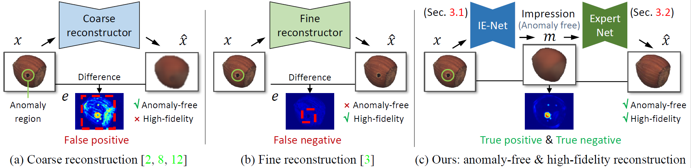
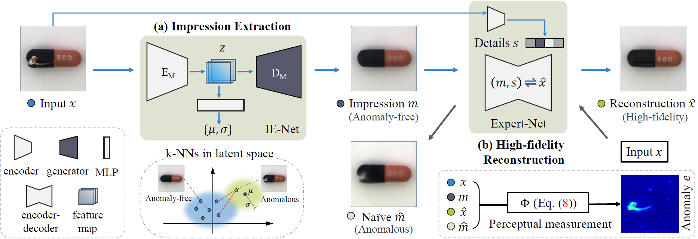

# UTAD: Unsupervised Two-Stage Anomaly Detection

Codes for UTAD

We propose an Unsupervised Two-stage Anomaly Detection (UTAD) for anomaly detection from a single image.

   

**Picture:**  *Many one-stage methods reconstruct the structure of the input but without details (A) or high-fidelity reconstruction yet draw in anomaly regions (B). (c) We tackle the contradiction by extracting the anomaly-free structure (m) and adding high-fidelity details in two stages*

   

**Picture:**  *Overview of the proposed method.*

## Testing code

Coming soon.

